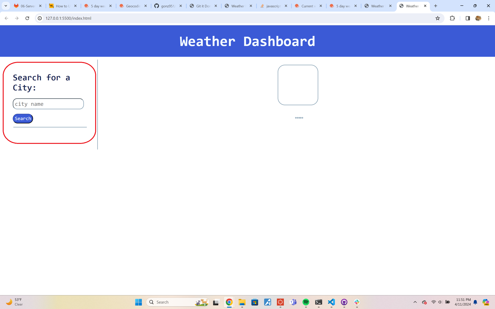
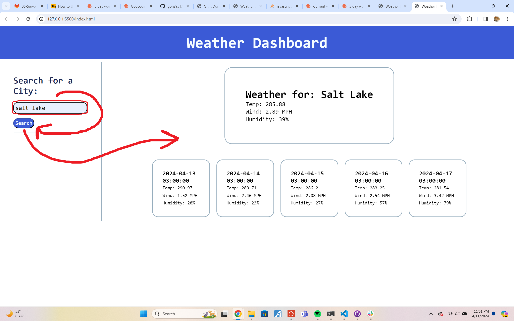

# weather-dashboard-dir

## Description

This project was meant to be a lesson on using server api's and how to navigate them. As a website, it's meant to be easy access for putting in your city and getting your weather back as a result. The js used isn't very inventive or nuanced, but it was my honest attempt at making the api work. From this assignment, I learned how to use an input to take in data, take that data, and put it onto a webpage. 

## Table of Contents 

- [Installation](#installation)
- [Usage](#usage)
- [Credits](#credits)
- [License](#license)

## Installation

No installation needed! Just a link: https://gonz951.github.io/weather-dashboard-dir/

(Might be finicky due to insecure source, but if opened on it's own it will work.)

## Usage

First, you go to the page and enter a city into the search bar. 

The search bar will take user input and run it through the api, then translate those results onto the page.

## Credits

Used Full-stack blog to get started:
https://coding-boot-camp.github.io/full-stack/apis/how-to-use-api-keys

Got help with the weather api forecast count here:
https://stackoverflow.com/questions/63222396/5-day-weather-forecast-on-openweathermap-not-giving-expected-result

## License

MIT License

Copyright (c) 2024 Paula 'Fel' Gonzalez

Permission is hereby granted, free of charge, to any person obtaining a copy
of this software and associated documentation files (the "Software"), to deal
in the Software without restriction, including without limitation the rights
to use, copy, modify, merge, publish, distribute, sublicense, and/or sell
copies of the Software, and to permit persons to whom the Software is
furnished to do so, subject to the following conditions:

The above copyright notice and this permission notice shall be included in all
copies or substantial portions of the Software.

THE SOFTWARE IS PROVIDED "AS IS", WITHOUT WARRANTY OF ANY KIND, EXPRESS OR
IMPLIED, INCLUDING BUT NOT LIMITED TO THE WARRANTIES OF MERCHANTABILITY,
FITNESS FOR A PARTICULAR PURPOSE AND NONINFRINGEMENT. IN NO EVENT SHALL THE
AUTHORS OR COPYRIGHT HOLDERS BE LIABLE FOR ANY CLAIM, DAMAGES OR OTHER
LIABILITY, WHETHER IN AN ACTION OF CONTRACT, TORT OR OTHERWISE, ARISING FROM,
OUT OF OR IN CONNECTION WITH THE SOFTWARE OR THE USE OR OTHER DEALINGS IN THE
SOFTWARE.
